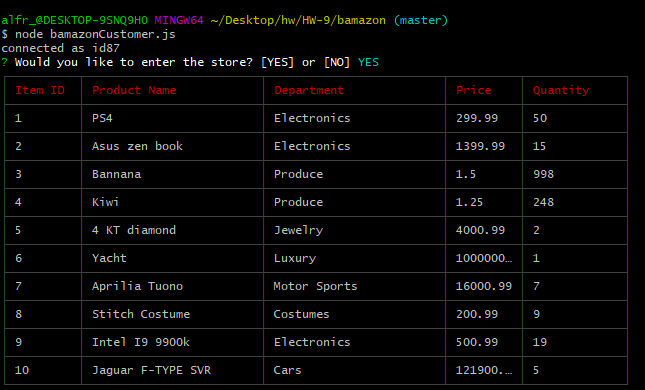
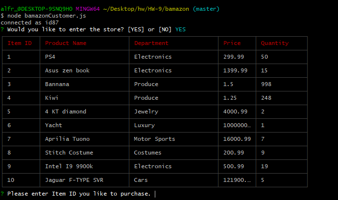
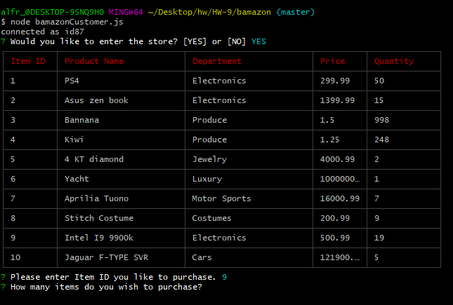
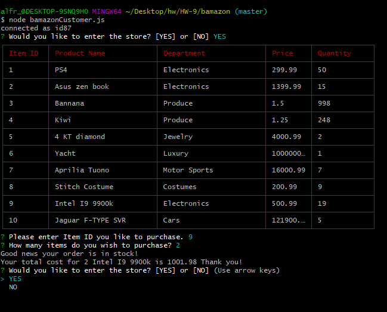
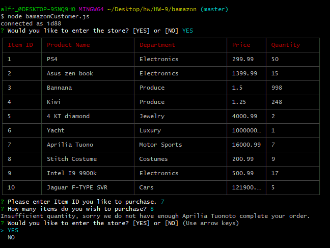

# bamazon

In this app the user will be able to run through an online buying experience mocking that of amazon.
The user will be prompted with a welcome page saying if you would like to like to enter the store or exit.

If user selects "no" the app closes and brings you back to your console.

If the user selects "yes" the app will then sow a table of the available products to buy, it will show name of the item, department, price, and the stock available.

After the that the user will be asked what it em the will would like to buy, they will select the item by the id of the item.

After that the user will be asked how many they would like to buy.

If there is enough it will give them the total of the  purchase and a thank you message and start all over.

If there is not enough it will show the user a sorry message and start all over

